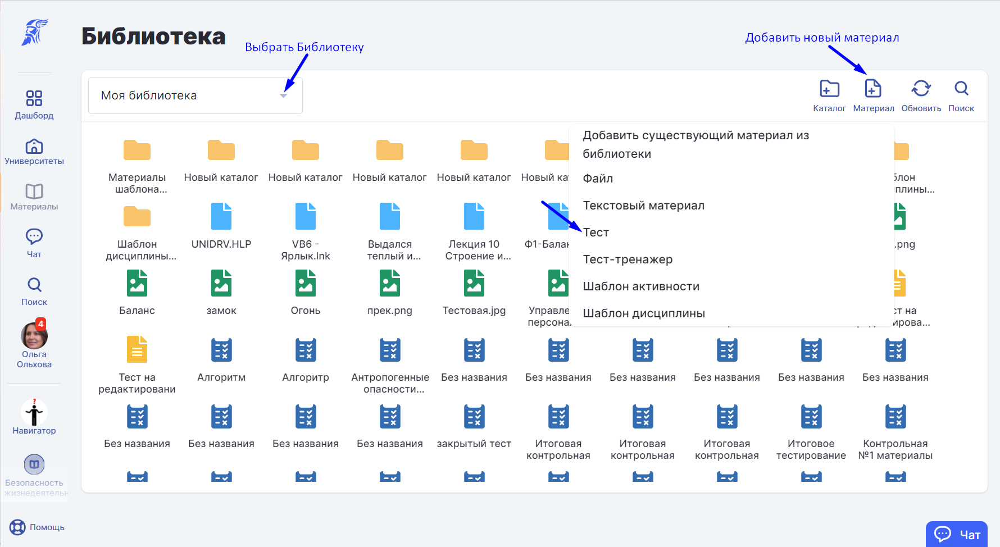
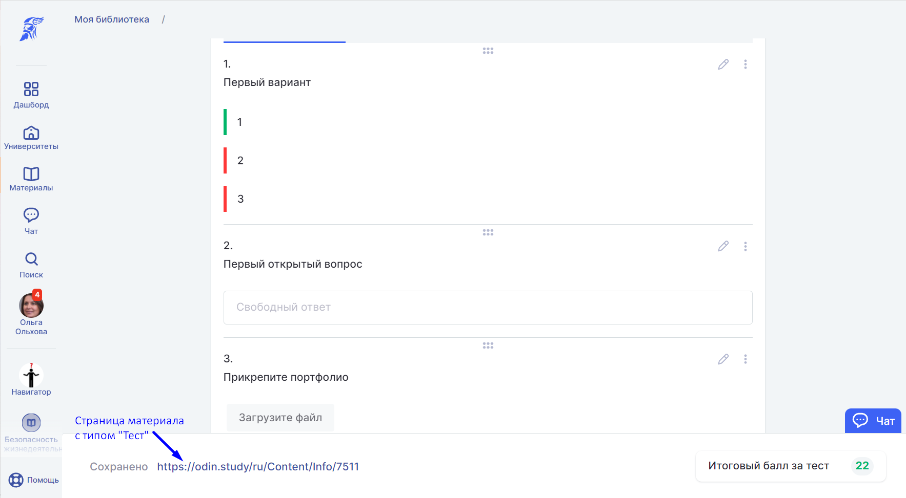
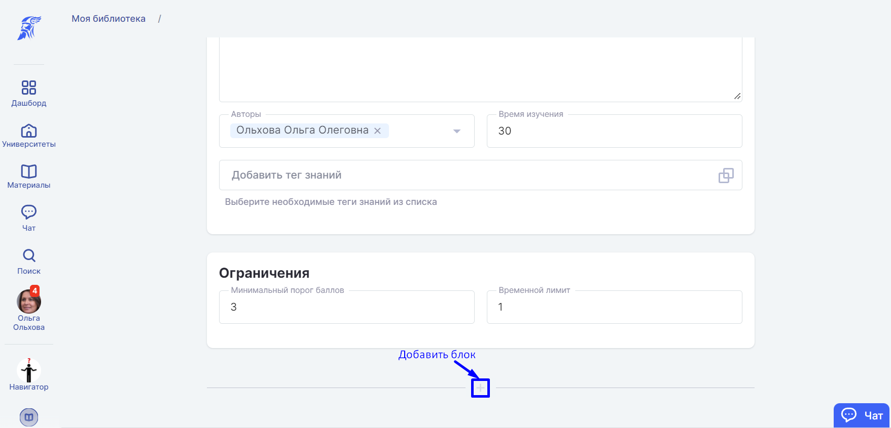
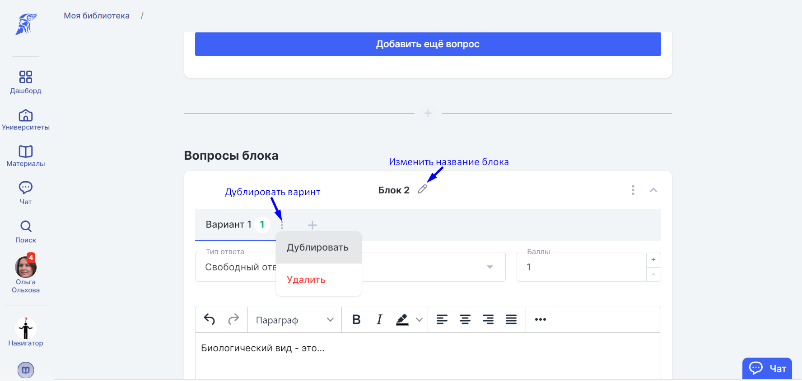
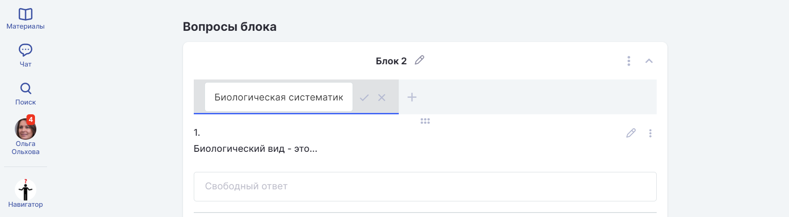
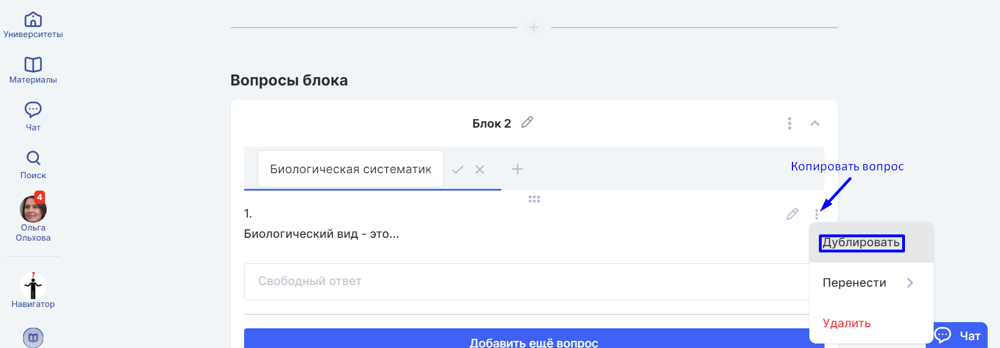
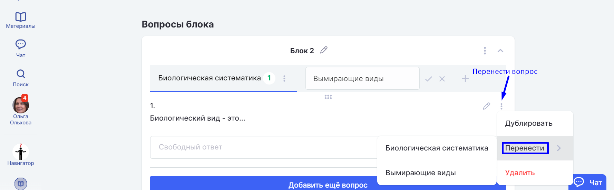
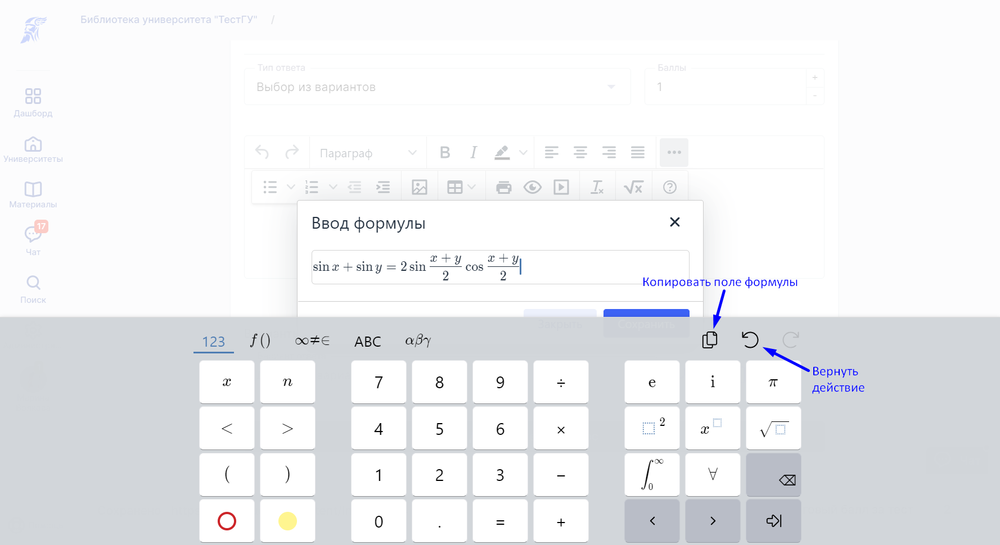

Для закрепления информации по теме активности и самоконтроля студента используйте материал с типом "Тест". Тест создаётся в конструкторе тестов.

Чтобы попасть в конструктор тестов, [добавьте материал](./../../../dobavlenie-materialov-2) с типом "Тест" в доступной библиотеке.

Тест автоматически сохраняется под ссылкой редактирования теста в конструкторе. При выходе со страницы редактирования теста заново найти его можно в выбранной для доступа теста [Библиотеке](./../../../_index).

:::info 

Материал с типом "Тест" можно добавить **только** в [активность](./../../../../../struktura/disciplina/aktivnosti/_index) с типом "[Контрольная](./../../../../../struktura/disciplina/aktivnosti/kontrolnaya/_index)".

:::

Блоки группируют вопросы, например, по сложности или темам.

Чтобы добавить Блок, нажмите "+".

Вопросы объединяются в варианты. У вариантов должно быть равное количество баллов. При выполнении теста [студенты](./../../../../../roli-v-sisteme/studenty) получат случайный вариант.

Чтобы добавить Вариант, нажмите "+".

Заполните вопросы теста и варианты ответов, если это характерно для выбранного типа вопроса, и нажмите на три точки рядом с Вариантом: в выпадающем списке выберите "Дублировать".

Кликните 2 раза по заголовку варианта, чтобы переименовать его.

Если нужно копировать вопрос в текущий вариант, то после создания вопроса нажмите на три точки рядом с кнопкой Редактировать и продублируйте вопрос. Затем в него можно внести изменения (например, числовые).

Также вопрос после создания или редактирования можно перенести в выбранный вариант. Для этого, нажмите на три точки рядом с карандашом и выберите пункт "Перенести", а затем нужный вариант.

:::info 

Редактировать и дополнять варианты теста после создания можно независимо друг от друга.

:::

:::info 

Студент получит наиболее уникальный вариант теста, если в нем будет несколько блоков и вариантов.

:::

Чтобы вывести формулу, нажмите три точки в меню редактирования вопроса.

