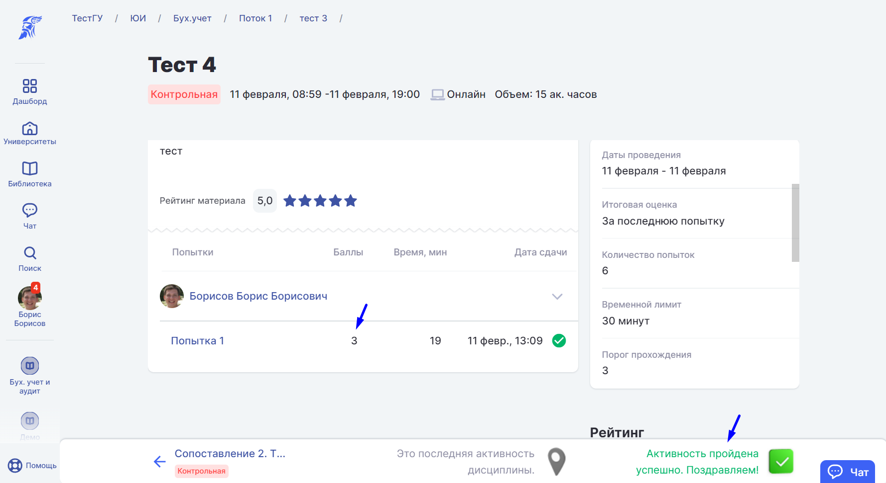
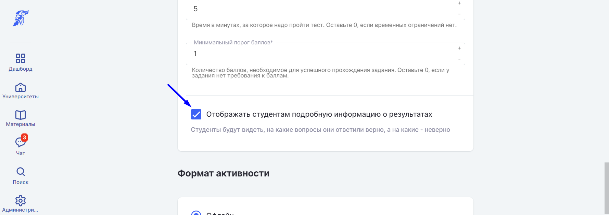
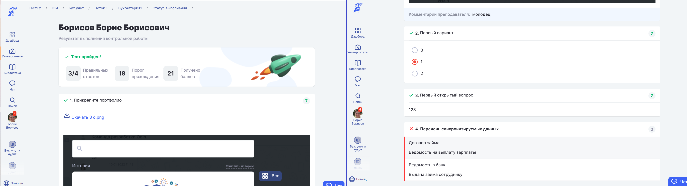
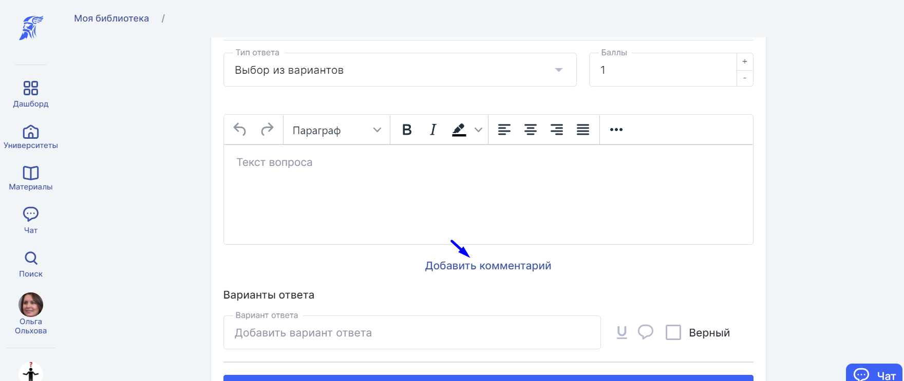
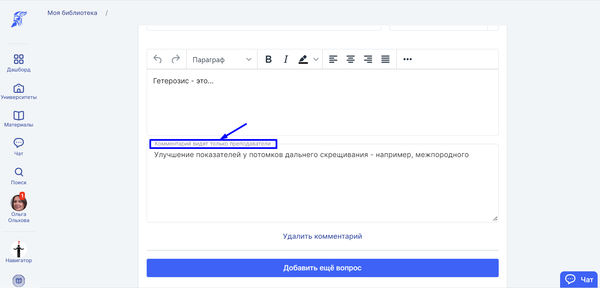

В системе Odin есть 6 видов вопросов, каждый с установленным количеством баллов за правильный ответ:

1. [Вопрос с сортировкой ответов](./vopros-s-sortirovkoy-otvetov)

2. [Вопрос со свободным вариантом ответов](./vopros-so-svobodnym-variantom-otvetov/_index)

3. [Вопрос с вариантами ответов]()

4. [Вопрос на сопоставление ответов](./vopros-na-sopostavlenie-otvetov)

5. [Вопрос, где в качестве ответов принимается файл](./vopros-gde-v-kachestve-otvetov-prinimaetsya-fayl)

6. [Вопрос, где в качестве ответов заполняются пропуски по тексту](./vopros-gde-v-kachestve-otvetov-zapolnyayutsya-pr)

После прохождения тестирования в "[Контрольной](./../../../../../../struktura/disciplina/aktivnosti/kontrolnaya/_index)" студент сможет увидеть два варианта результатов, в зависимости от установленной настройки. Если настройка «Отображать студентам подробную информацию о результатах» отключена (включить/отключить настройку можно на странице создания или редактирования Контрольной), то студент увидит просто пройден тест или нет и полученное за его прохождение количество баллов.

:::info 

Студент должен набрать пороговый балл, чтобы активность попала к нему в прогресс, иначе активность будет считаться непройденной.

:::

Если настройка «Отображать студентам подробную информацию о результатах» включена, то студент сможет увидеть детализацию вопросов во всем тесте, свою лучшую попытку (лучшая попытка студента будет отмечена звёздочкой на странице результатов Контрольной) и оставленные комментарии к тому варианту, который дал студент, вне зависимости от того, правильный ответ или нет.

Комментарии для студентов добавляет Автор теста при его создании.

:::info 

Комментарии показаны только к тому варианту, который отмечает студент и указано, правильный ли его вариант или нет, без указания правильного варианта, если студент ошибся. Для этого рядом с полем для ввода варианта ответа есть иконка добавления комментария.

:::

Кроме того, при создании любого тестового вопроса автор может добавить комментарий для себя, этот комментарий будет виден преподавателю при проверке работы, но скрыт от студента.

