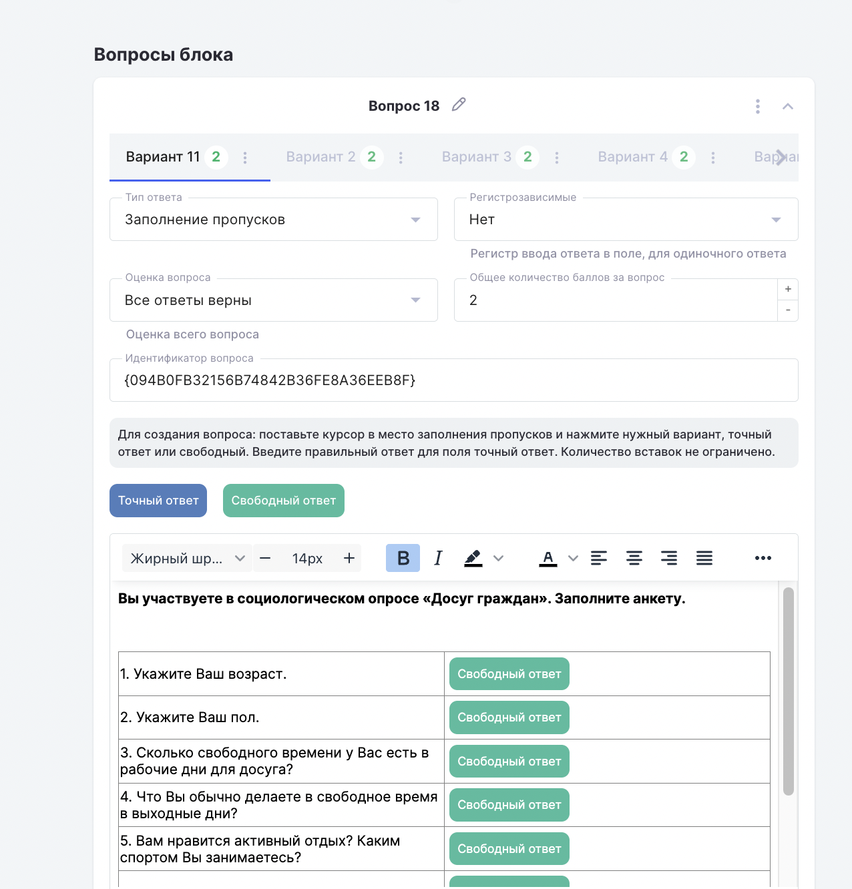

В данном типе вопроса есть возможность выбрать одну из настроек «Точный ответ» - проверяется системой автоматически на соответствие с введенными автором вариантами ответов или «Свободный ответ» - проверяется преподавателем вручную, после того, как студент пройдёт тест.

{width=1276px height=1332px}