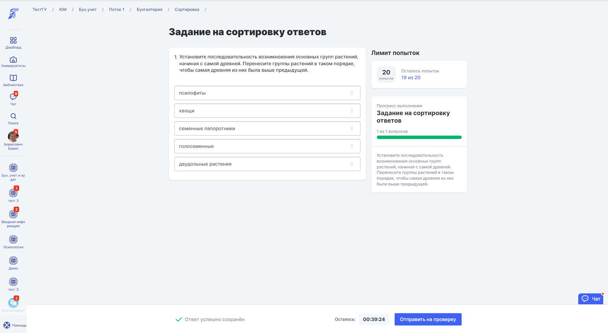

Автор добавляет вопрос с вариантами, располагая ответы в правильной, исходя из вопроса, последовательности. Студенту необходимо перетягиванием вариантов ответа установить их правильный порядок, установленный Автором.

{width=1778px height=975px}