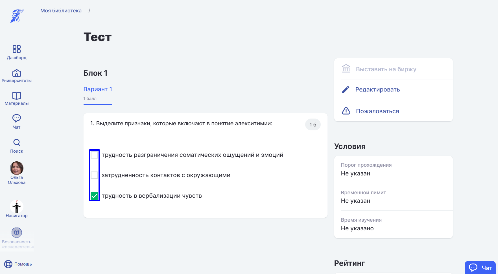

В данном типе вопросов автор может указать, как один верный вариант из представленного списка вариантов, так и несколько.

{width=1764px height=973px}

-  Если указан 1 верный вариант, то студент увидит отображение отметки вариантов в виде Radiobutton - возможность отметить только один вариант.

-  Если указано несколько верных вариантов ответов, то студент увидит отображение отметки вариантов в виде CheckBox - возможность отметить несколько верных вариантов из предложенных.