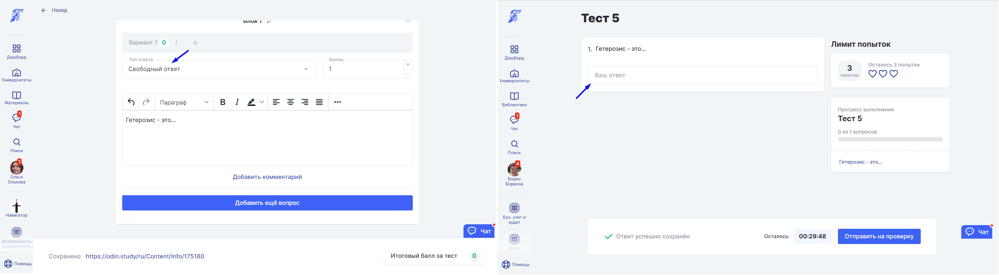

Автор при создании теста записывает вопрос или вопросы, а студент открывает тест, печатает ответ и отправляет его на проверку, после проверки студент видит правильный он дал ответ или нет.

{width=3548px height=976px}