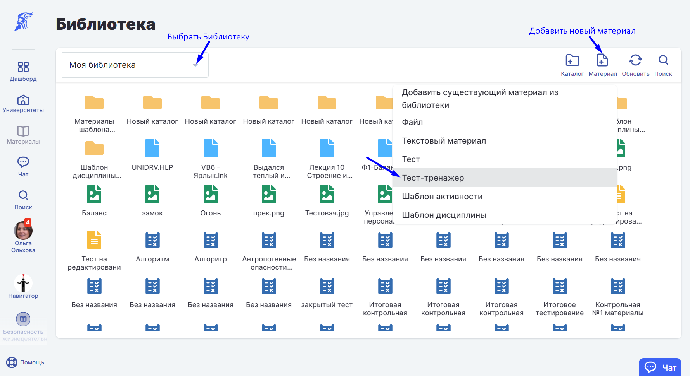
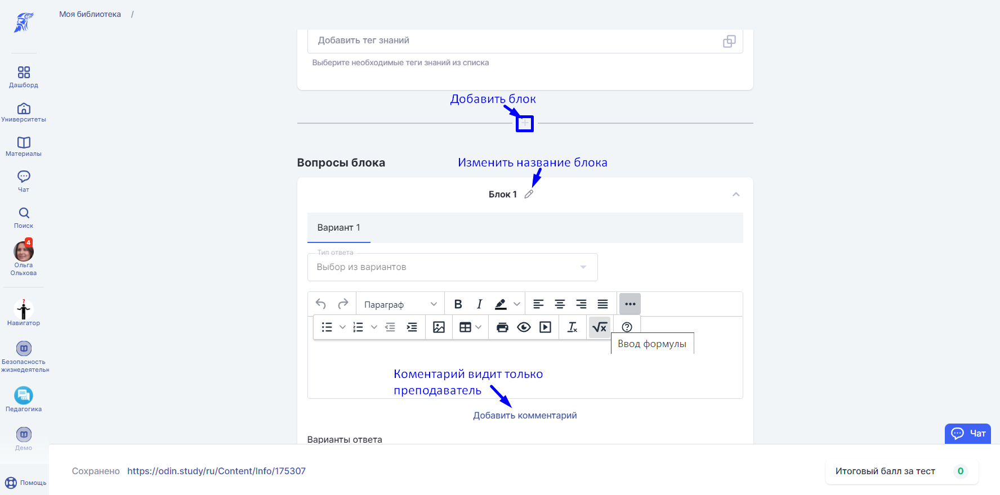
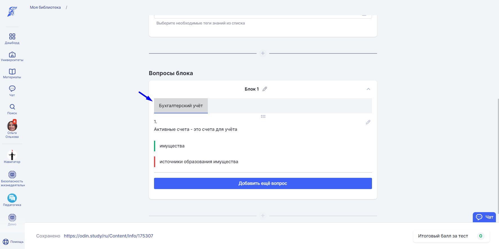
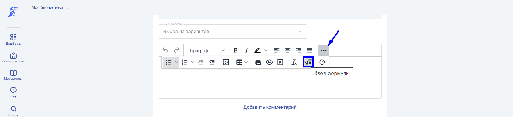
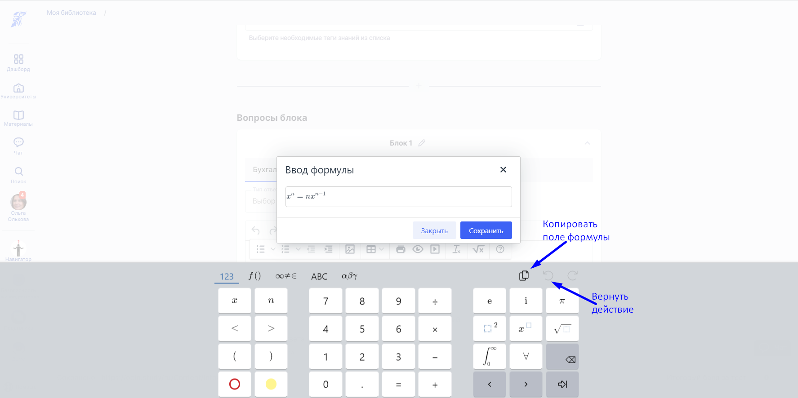
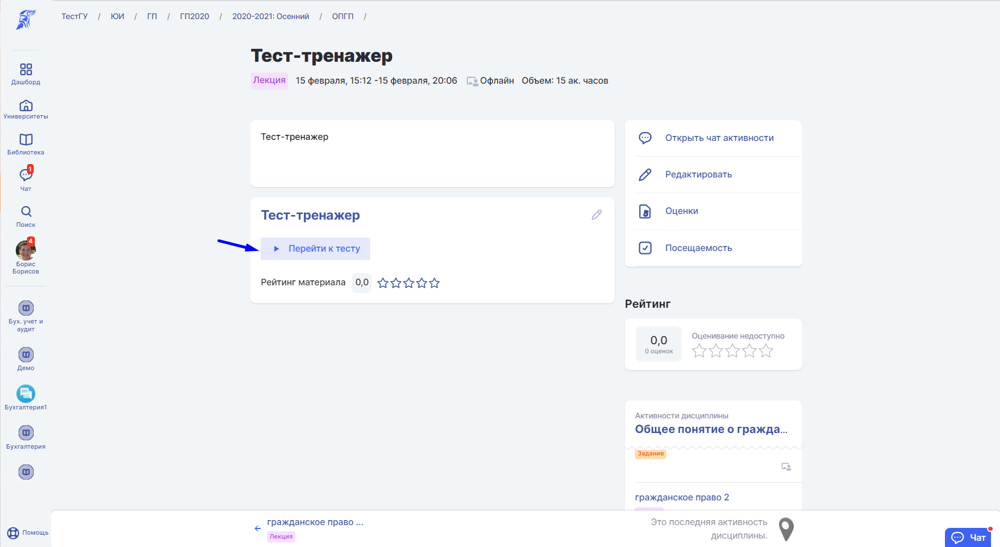
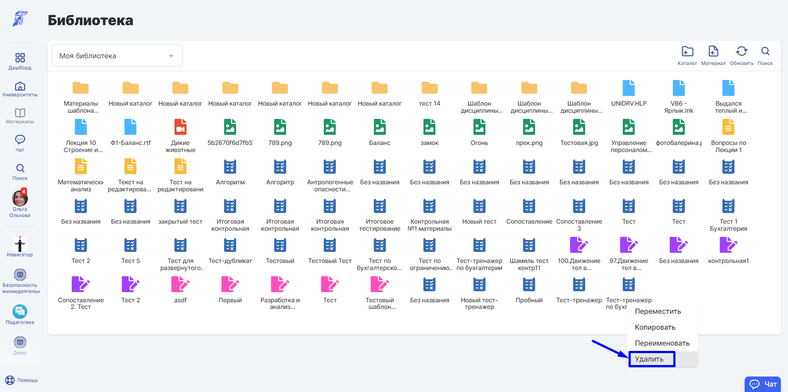

Для закрепления информации по теме активности и самоконтроля студента используйте материал с типом "Тест-тренажер".

:::info 

В  материал можно добавить только вопросы с вариантами ответа[.](https://blog.odin.study/tpost/6j11p4r301-kommentarii-k-variantam-otveta)

:::

.png>)

Тест автоматически сохраняется под ссылкой редактирования теста в конструкторе. При выходе со страницы редактирования теста, найти его можно в выбранной для доступа теста [Библиотеке](./../../_index).

Блоки группируют вопросы, например, по сложности или темам. Чтобы добавить новый блок, нажмите "+". Для изменения названия блока выберете карандаш.

Кликните 2 раза по заголовку варианта, чтобы переименовать его.

Чтобы вывести формулу, нажмите три точки в меню редактирования вопроса.

При выборе любого варианта ответа в вопросе сразу появляется комментарий преподавателя, с указанием правильный или неправильный вариант был выбран.

.png>)

[Студент](./../../../../roli-v-sisteme/studenty) при работе с активностью видит кнопку "Перейти к тесту", чтобы пройти тестирование.

:::info 

Прохождение тестов-тренажеров не приводит к появлению оценки за активность.

:::

:::info 

Тест-тренажер можно прикрепить в [шаблон активности](./../shablon-aktivnosti) для дальнейшего использования.

:::

Удалить материал с типом "Тест-тренажер" можно в выбранной для доступа материала Библиотеке при нажатии на него двойным кликом. Выберете пункт "Удалить".

