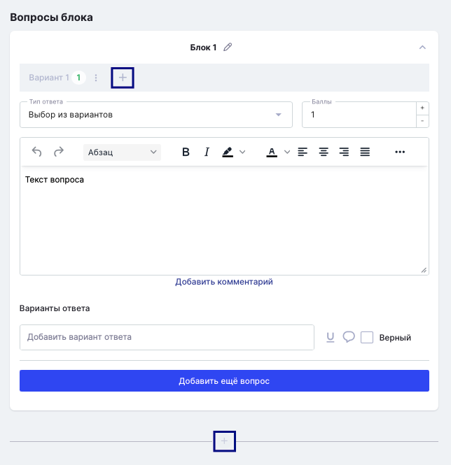

Для того, чтобы вариант, который достанется студенту при решении теста, был максимально уникальным, в системе предусмотрены блоки и варианты, которые можно добавить при создании теста. 

Добавление доступно на странице создания/редактирования теста. Вариант добавляется по кнопке + в строке вариантов, а блок - в самом низу страницы. 

{width=644px height=665px}

Таким образом, можно разбить тест на несколько вариантов, а также на несколько блоков. В итоге студентам могут собраться следующие комбинации: 

Например, если добавлено 3 варианта и 3 блока, то одному студенту достанется 1 вариант из блока 1, 3 вариант из блока 2, 2 вариант из блока 3.  А кто-то будет решать 2 вариант из блока 1, 2 вариант из блока 2 и 2 вариант из блока 3. 

Таким образом, вопросы будут максимально перемешаны между собой. Чем больше вариантов и блоков, тем больше комбинаций.