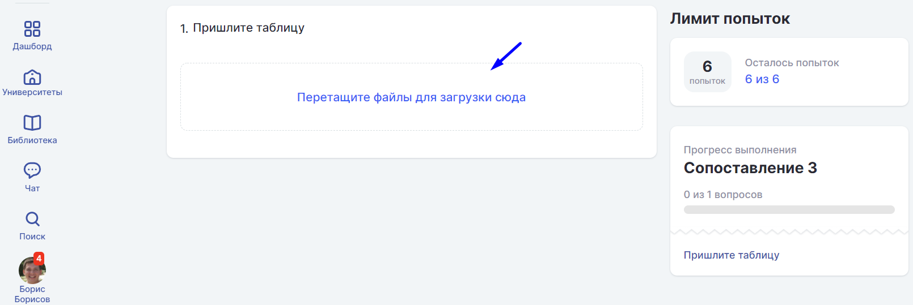
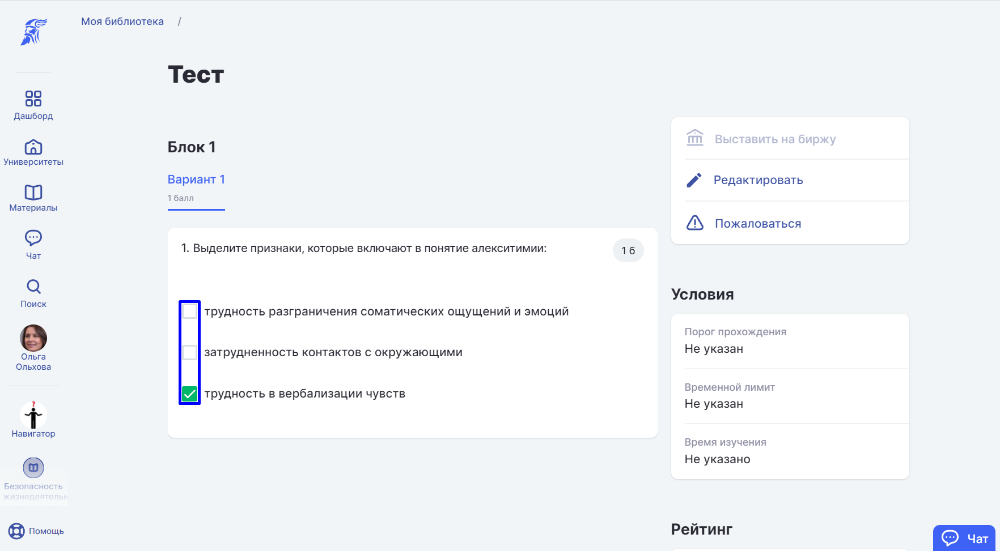

# Виды вопросов

В системе Odin есть четыре вида вопросов, каждый с установленным количеством баллов за правильный ответ:

1. Вопрос со свободным вариантом ответа.

Автор при создании теста записывает вопрос или вопросы, а студент открывает тест, печатает ответ и отправляет его на проверку, после проверки студент видит правильный он дал ответ или нет.

.png>)

2. Вопрос, где в качестве ответа принимается файл.

В этом случае автор при создании теста записывает вопрос или вопросы, а студент открывает тест, прикрепляет файл в дропзону для ответа и отправляет его на проверку. После проверки студент видит правильный он дал ответ или нет.

3.  Вопрос с вариантами ответов.

В данном типе вопросов автор может указать, как один верный вариант из представленного списка вариантов, так и несколько.

* Если указан 1 верный вариант, то студент увидит отображение отметки вариантов в виде Radiobutton - возможность отметить только один вариант.
* Если указано несколько верных вариантов ответов, то студент увидит отображение отметки вариантов в виде CheckBox - возможность отметить несколько верных вариантов из предложенных.

4. Вопрос на сопоставление. 

Автор при создании теста записывает верный вариант группировки элементов по определенным признакам. Студенту нужно упорядочить элементы в соответствии с условием задания Автора.

5. Вопрос с сортировкой ответов.

Автор добавляет вопрос с вариантами, располагая ответы в правильной, исходя из вопроса, последовательности. Студенту необходимо перетягиванием вариантов ответа установить их правильный порядок, установленный Автором.

После прохождения тестирования в "[Контрольной](../../../../struktura/aktivnosti/kontrolnaya/)" студент сможет увидеть два варианта результатов, в зависимости от установленной настройки. Если настройка «Отображать студентам подробную информацию о результатах» отключена (включить/отключить настройку можно на странице создания или редактирования Контрольной), то студент увидит просто пройден тест или нет и полученное за его прохождение количество баллов.

:::info

Студент должен набрать пороговый балл, чтобы активность попала к нему в прогресс, иначе активность будет считаться непройденной.

:::

Если настройка «Отображать студентам подробную информацию о результатах» включена, то студент сможет увидеть детализацию вопросов во всем тесте, свою лучшую попытку (лучшая попытка студента будет отмечена звёздочкой на странице результатов Контрольной) и оставленные комментарии к тому варианту, который дал студент, вне зависимости от того, правильный ответ или нет.

Комментарии для студентов добавляет Автор теста при его создании.

:::info

Комментарии показаны только к тому варианту, который отмечает студент и указано, правильный ли его вариант или нет, без указания правильного варианта, если студент ошибся. Для этого рядом с полем для ввода варианта ответа есть иконка добавления комментария.

:::

Кроме того, при создании любого тестового вопроса автор может добавить комментарий для себя, этот комментарий будет виден [преподавателю](broken-reference) при проверке работы, но скрыт от студента.

