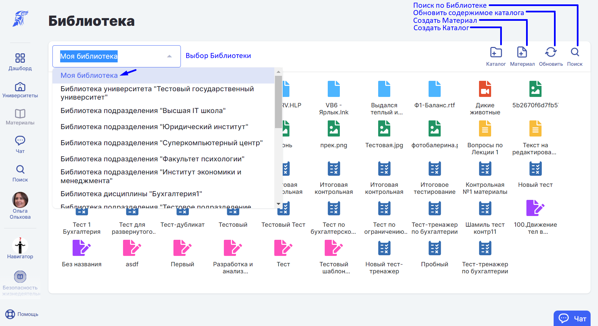
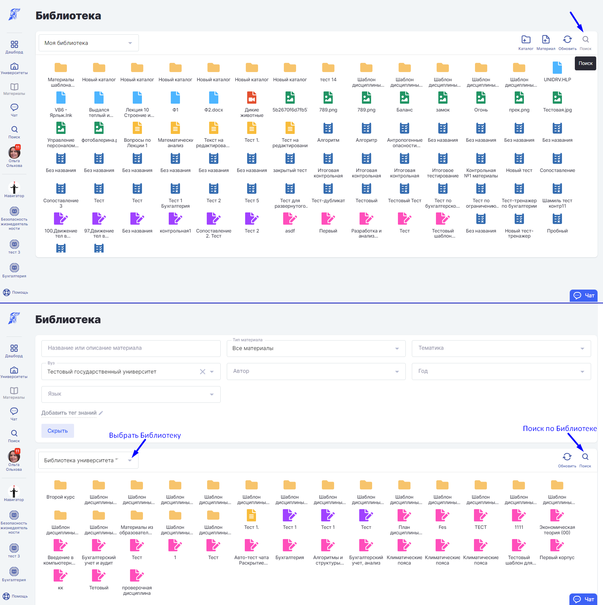

# Поиск материалов

Выберете в разделе "Материалы" пункт "Библиотека".

В Библиотеке возможно упорядочить [материалы](materialy/), распределив их по каталогам. Также есть доступ к библиотекам дисциплин.

Чтобы найти материал по Библиотеке, нажмите лупу в правом верхнем углу. Выберете учебное заведение в поиске.

