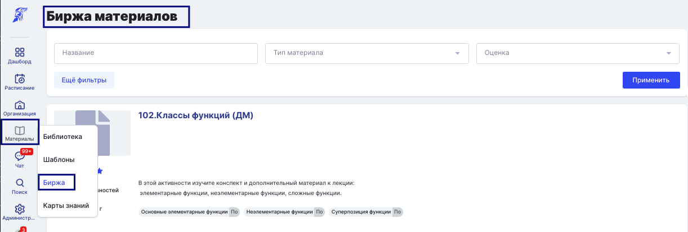

**Автор** материала может выложить добавленные в систему материалы на **биржу** для взаимообмена с другим авторами/вузами.

Это сильно расширяет объем информации, которую преподаватели могут предоставлять студентам для изучения, что повышает уровень и качество получаемого образования. Оно не ограничено  наработками одного конкретного автора/вуза.

{width=1222px height=414px}