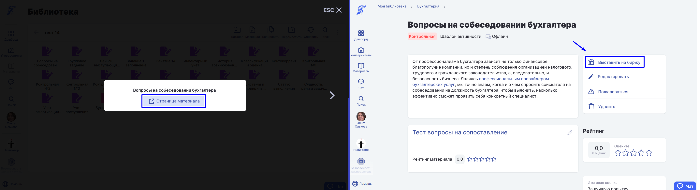

:::info 

Материал на биржу может выставит только его автор/авторы. \
Авторов материала можно указать/добавить на странице редактирования материала.

:::

После [добавления](./../biblioteka/dobavlenie-materialov) материала в систему его можно выложить на биржу.

**1\.** Откройте материал из [Библиотеки](./../biblioteka/_index). Для этого в меню нажмите Материалы - Библиотека и кликните по нужному материалу.

Для быстрого поиска материала можно выбрать доступную библиотеку из списка и использовать Поиск.

 (1) (1).png>)

**2\.** Откройте страницу материала  и нажмите  "Выставить на биржу".

**3\.** При необходимости дополните описание материала и нажмите "**Выставить**".

.png>)

**4\.** Материал выставлен на биржу.

.png>)

:::info 

Обратите внимание! На биржу отдельно можно выложить шаблон активности и шаблон дисциплины.

:::

#### **Как удалить материал с биржи?**

Чтобы удалить материал с биржи,  откройте страницу материала и выберите пункт **Убрать с биржи**.

:::info 

Скрыть материал с биржи может только его автор/авторы.

:::

.png>)

#### Как найти материал на бирже?

В меню Материалы - Биржа  для поиска нужного материала  можно использовать предложенные фильтры:

-  Название

-  [Тип материала](./../biblioteka/materialy/_index)

-  Университет

-  Оценка

-  Тематика

-  Год издания

-  Тег знаний

