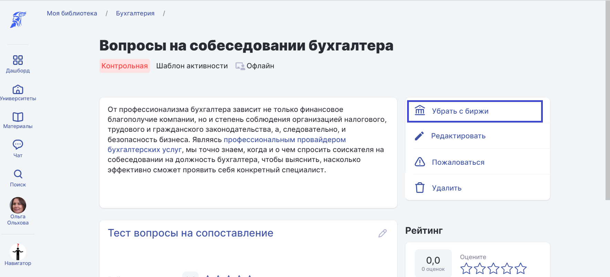

# Добавление материалов на биржу


Материал на биржу может выставит только его автор/авторы. \
Авторов материала можно указать/добавить на странице редактирования материала.


После [добавления](../biblioteka/dobavlenie-materialov.md) материала в систему его можно выложить на биржу.&#x20;

**1.** Откройте материал из [Библиотеки](../biblioteka/). Для этого в меню нажмите Материалы - Библиотека и кликните по нужному материалу.&#x20;

Для быстрого поиска материала можно выбрать доступную библиотеку из списка и использовать Поиск.

.png>)

**2.** Откройте страницу материала  и нажмите  "Выставить на биржу".&#x20;

.png>)

**3.** При необходимости дополните описание материала и нажмите "**Выставить**".

**4.** Материал выставлен на биржу.&#x20;


Обратите внимание! На биржу отдельно можно выложить шаблон активности и шаблон дисциплины.




#### **Как удалить материал с биржи?**

Чтобы удалить материал с биржи,  откройте страницу материала и выберите пункт **Убрать с биржи**.&#x20;


Скрыть материал с биржи может только его автор/авторы.


.png>)

#### Как найти материал на бирже?

В меню Материалы - Биржа  для поиска нужного материала  можно использовать предложенные фильтры:&#x20;

* Название
* [Тип материала](../biblioteka/materialy/)
* Университет
* Оценка
* Тематика
* Год издания
* Тег знаний

