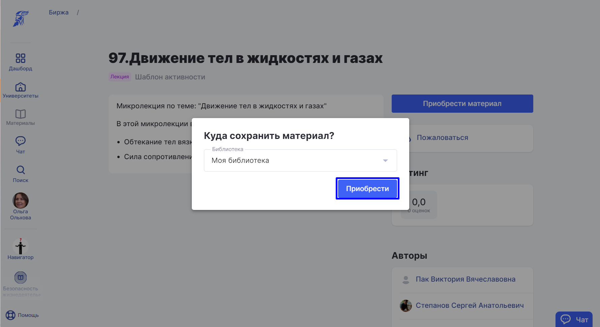
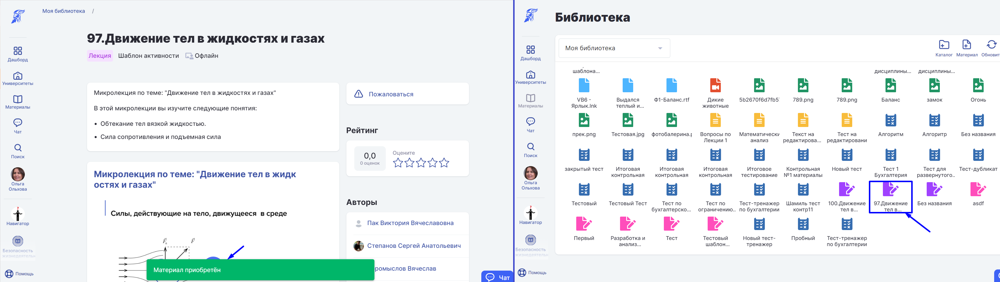

# Приобретение материалов

:::info

Приобрести материал можно на [бирже](./), на странице материала.

:::

1\. Выберете в разделе "Материалы" пункт "Биржа".

2\. Примените фильтры для поиска материалов на бирже и выберете нужные материалы.

:::info

**Сохраненные фильтры** позволяют один раз выставить настройки и использовать их для получения быстрого списка в дальнейшем.

:::

3\. Нажмите "Приобрести материал".

4\. Выберете библиотеку, в которую будет сохранён приобретённый материал, и нажмите "Приобрести".

5\. После добавления материала в библиотеку появится уведомление "Материал приобретён".

:::info

У тех пользователей, у которых ранее был приобретён материал на бирже, после скрытия материала автором, сохраняется доступ к этому материалу в личной [библиотеке](../biblioteka/).

:::

