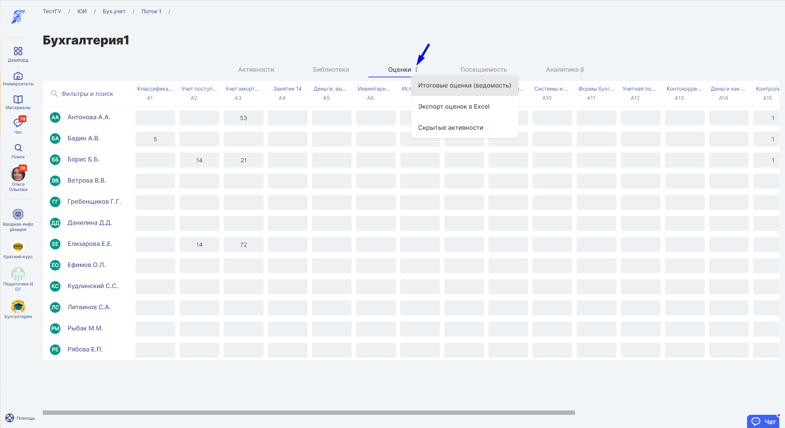
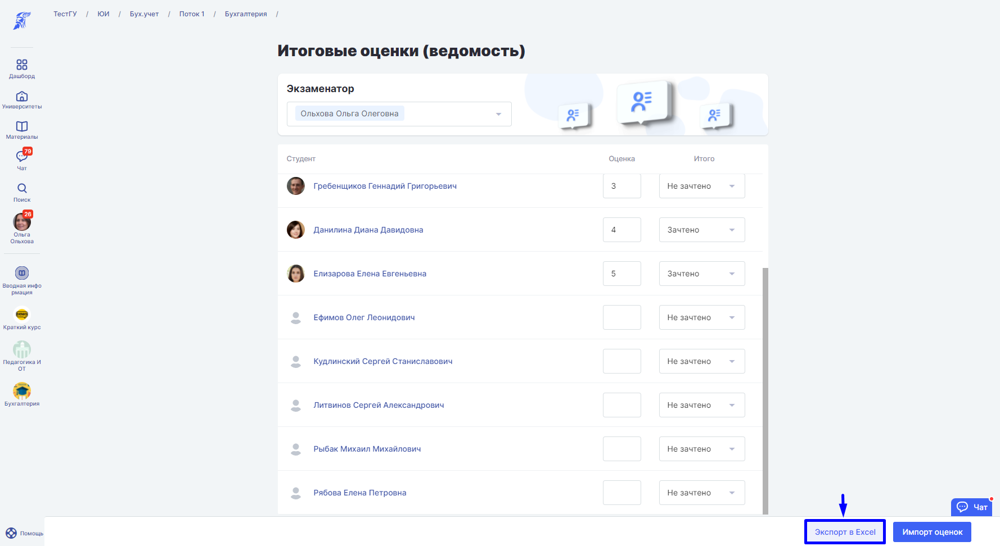
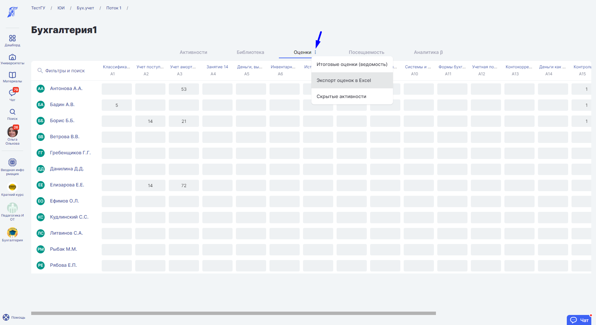
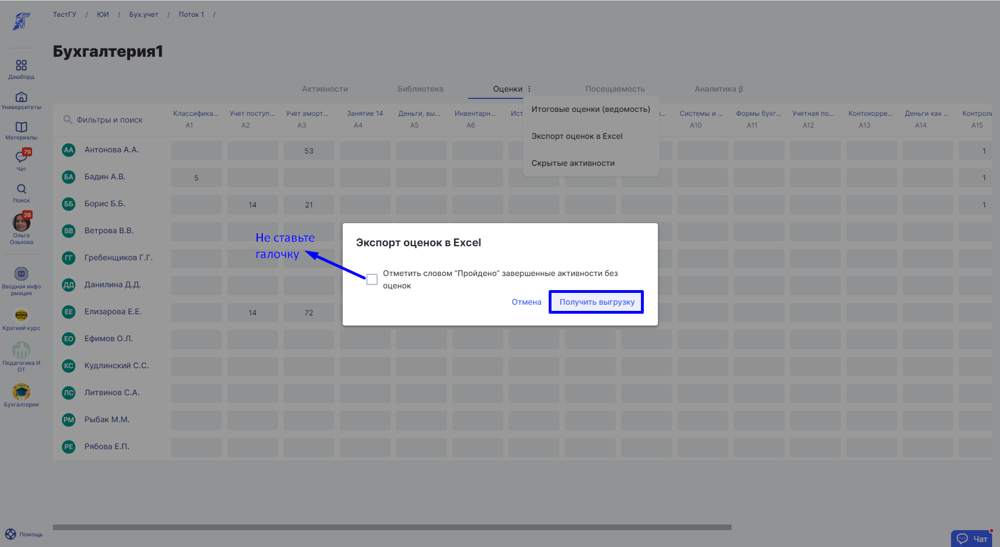
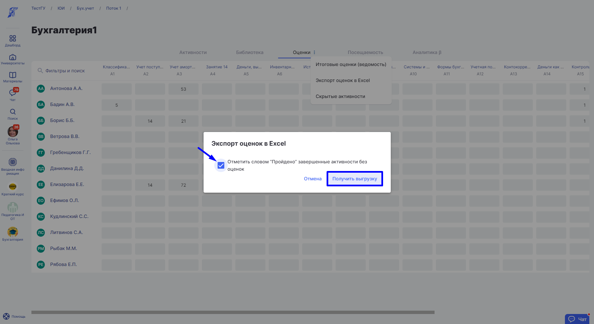
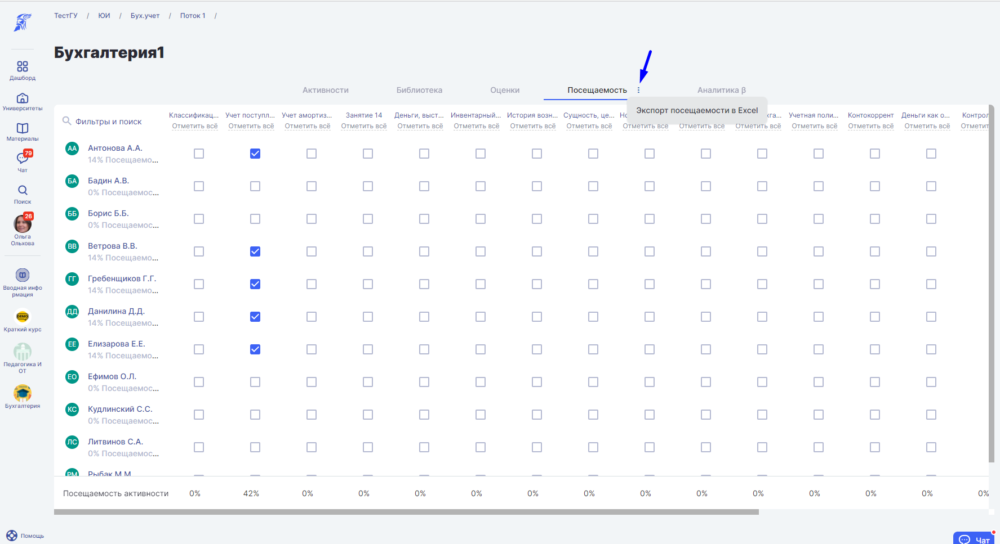

# Выгрузки на странице дисциплины

[tabs]
[tab:Итоговые оценки (ведомость)]

На странице Дисциплины по вкладке Оценки нажмите три точки и выберите Итоговые оценки (Ведомость).

Нажмите кнопку “Экспорт в Excel“.

[/tab]

[tab:Экспорт oценок в Excel]

На странице Дисциплины по вкладке Оценки нажмите три точки и выберите “Экспорт oценок в Excel”.

В появившемся после нажатия кнопки “Экспорт oценок в Excel“ окошке **не ставьте** галочку “Отметить словом “Пройдено“ завершенные активности без оценок“. Далее нажмите на кнопку “Получить выгрузку“.

[/tab]

[tab:Расширенный экспорт оценок в Excel]

На странице Дисциплины по вкладке Оценки нажмите три точки и выберите “Экспорт oценок в Excel”.

При клике на кнопку “Экспорт оценок в Excel” появляется окно с неотмеченным по умолчанию пунктом: “Отметить словом “Пройдено” завершенные активности без оценок“. Поставьте пункт галочкой.

В расширенном экспорте у активностей без оценок, если студент получил статус “Пройдено”, написано в ячейке слово “пройдено”.

[/tab]

[tab:Экспорт посещаемости в Excel]

На странице Дисциплины по вкладке Посещаемость нажмите три точки и выберите “Экспорт посещаемости в Excel”.

Заливка ячейки серым цветом означает, что студент не записан на эту активность, также в выгрузке отображается средняя посещаемость по студенту в целом и по каждой отдельной активности.
[/tab]

[tab:Аналитика со страницы дисциплин]

На странице дисциплины во вкладке Аналитика нажмите три точки и выберите пункт “Экспорт в Excel“.

 (1) (1).png>)
[/tab]
[/tabs]

