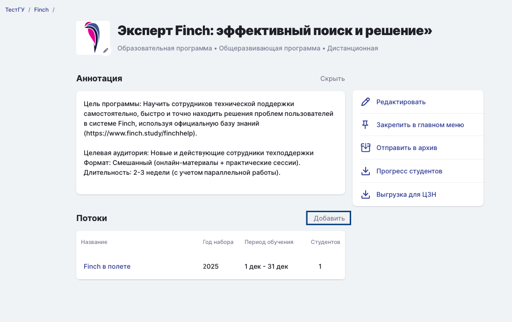
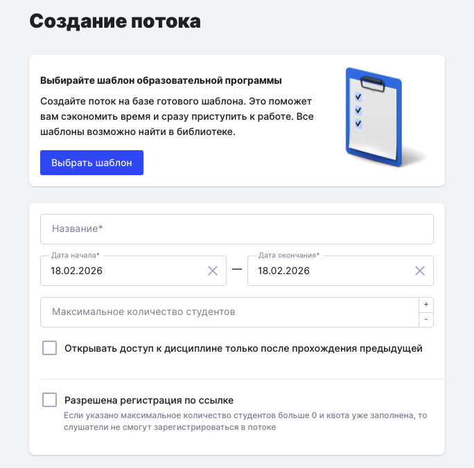
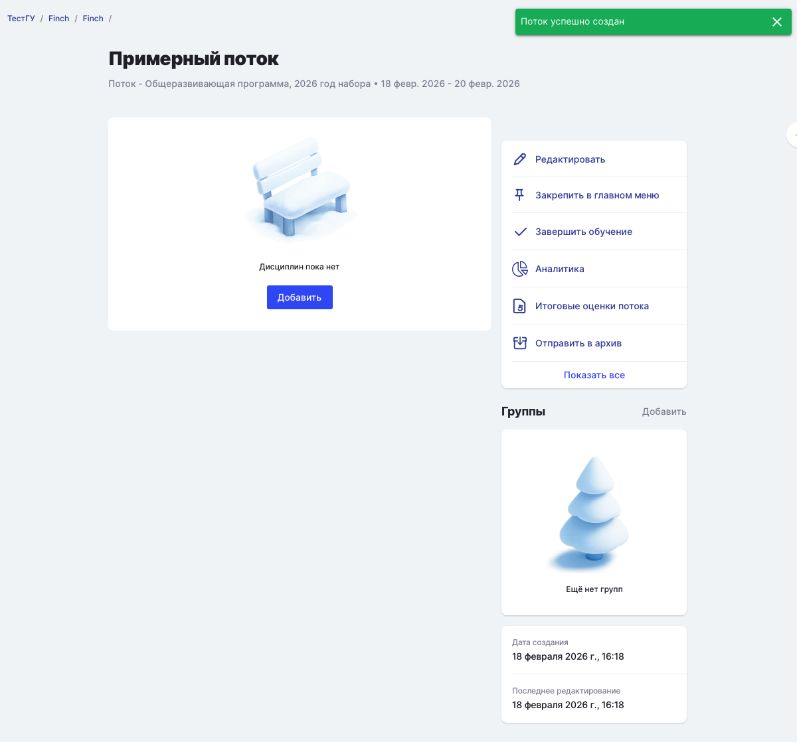
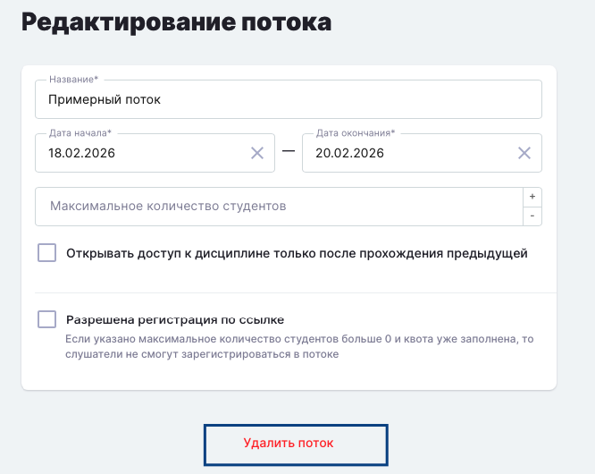
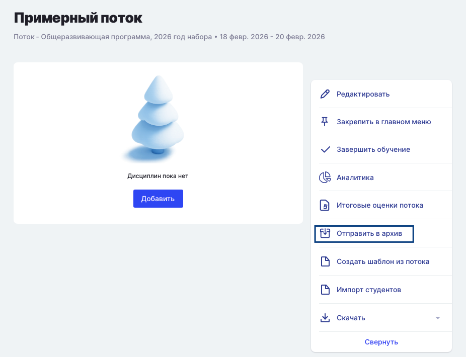
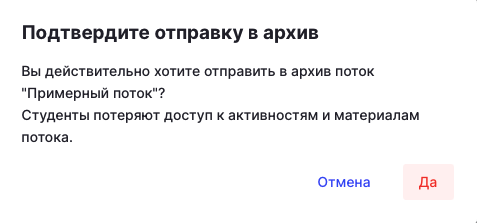
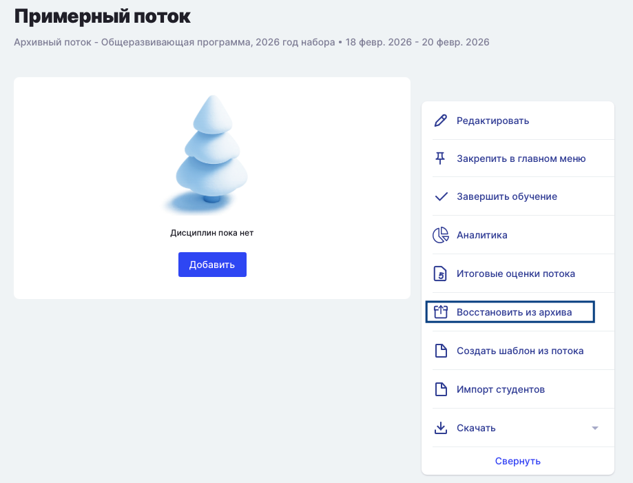

Добавить поток можно на странице Образовательной программы.

{width=1095px height=689px}

Поток может быть создан на основе [шаблона Образовательной программы](./../shablon-programmy-osnovnogo-obrazovaniya/sozdat-novyi-shablon-programmy), если он уже заполнен. Но первый Поток создавать без шаблона удобнее. После внесения всей информации по Потоку, а точнее, добавление семестров, дисциплин, активностей, установки необходимых настроек и даже после проведения обучения можно создать шаблон программы для следующих потоков.

#### Заполнение информации  при создании потока

-  Если у Вас уже есть заполненные шаблоны программы, можно выбрать из них или оставить первое поле пустым.

-  Год набора автоматически указывается текущий,  при необходимости его можно изменить, если вы добавляете поток, например, для второго курса. То есть указывайте фактический год набора.

-  Укажите название Потока. Пример, "Поток 1\_Педагогика".

-  Выставите даты начала и окончания обучения.

-  Установите максимальное количество студентов в Потоке. Рекомендуем создавать потоки не более 300 человек. Если количество слушателей больше, создайте ещё 1 поток.

-  {width=684px height=676px}

После сохранения данных Вы автоматически будете переадресованы на страницу нового созданного Потока с уведомлением, что Поток создан. По кнопке Редактировать можно изменить/скорректировать данные по Потоку. По кнопке Добавить можно добавить новую[ группу](./../../../gruppa), указать её название, прикрепить [Куратора](https://informa.gitbook.io/novosti-odin/novosti/novaya-rol-kurator), внести [студентов](./../../../../roli-v-sisteme/studenty).

{width=1200px height=1118px}

Далее добавьте информацию о [семестрах](./../dobavlenie-semestra).

:::info 

Добавить следующий Поток можно  на странице Образовательной программы

:::

### Как удалить Поток?

Необходимо зайти в редактирование потока, и если по потоку не проводилось обучение, в нем нет дисциплин и семестров, то по кнопке Удалить поток данный поток удалится из системы.

{width=666px height=530px}

### Как отправить Поток в архив?

Для отправки потока в архив необходимо зайти на страницу потока, в правом столбце функций нажать Показать все, выбрать Отправить в архив. Поток окажется в архиве.

{width=926px height=710px}

Надо будет подтвердить отправку в архив.

{width=477px height=223px}

Кнопка изменит своё название на Восстановить из архива соответственно.

{width=919px height=701px}