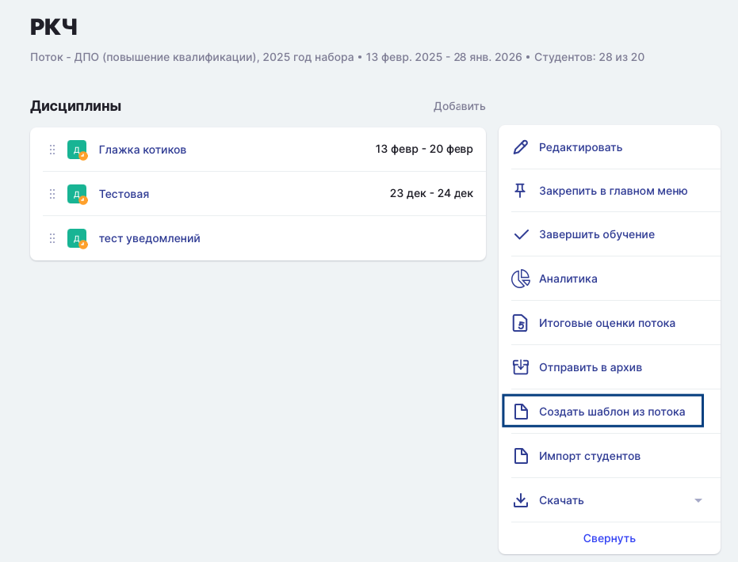
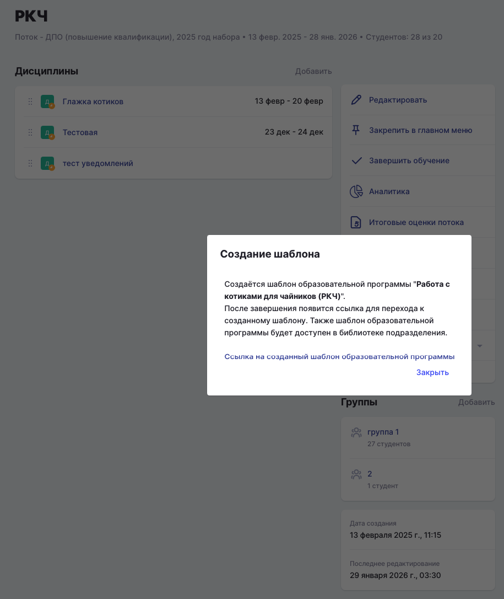
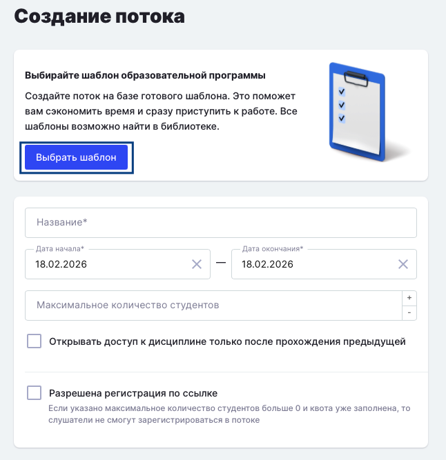
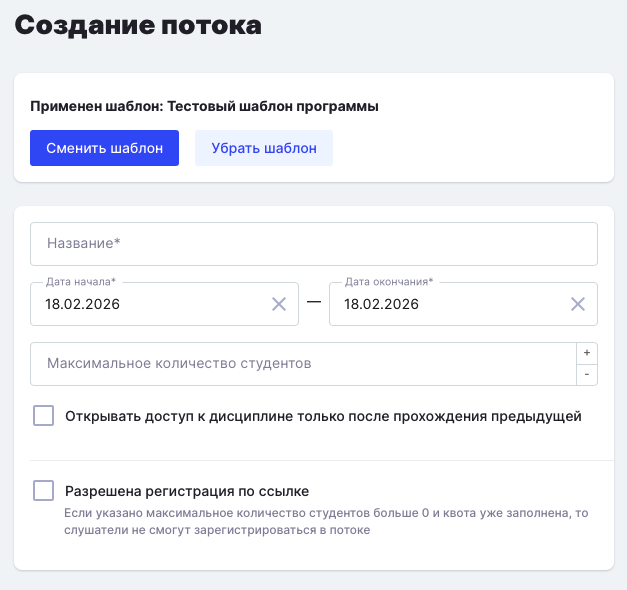

:::info 

До начала создания шаблона программы ДО рекомендуем сразу создать [шаблоны дисциплин](./../../../disciplina/shablon-discipliny), которые будут использованы в основе шаблона ДО. Как добавить их к шаблону программы ДО будет описано ниже.

:::

Если обучение по программе пока не проводилось, первый поток рекомендуем наполнить вручную, а уже далее создать из него шаблон.

Создать шаблон можно со страницы потока по кнопке "Создать шаблон из потока".

{width=931px height=710px}

После создания появляется информационное окно с информацией, что шаблон создаётся, также отображается ссылка на созданный шаблон. При переходе по ссылке можно отредактировать шаблон, удалить или добавить в него активности, модули, темы.

{width=915px height=1086px}

Добавить шаблон программы (потока) можно со страницы создания потока, нажав на кнопку "Выбрать шаблон".

{width=646px height=667px}

После применения шаблона к созданию потока остается заполнить обязательное поле с названием и датами начала и окончания.

{width=627px height=590px}

После нажатия на "Сохранить" появляется поток на основании ранее созданного шаблона.

