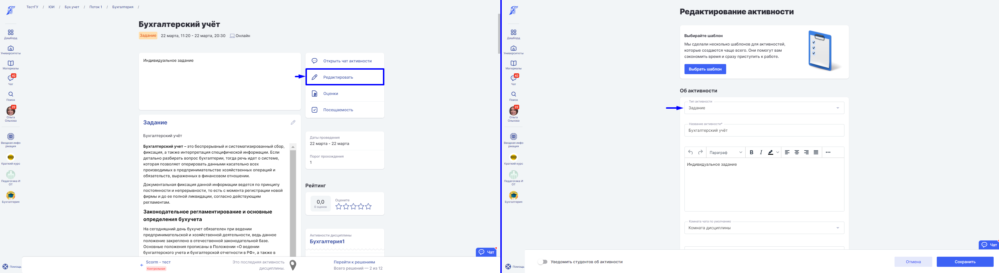
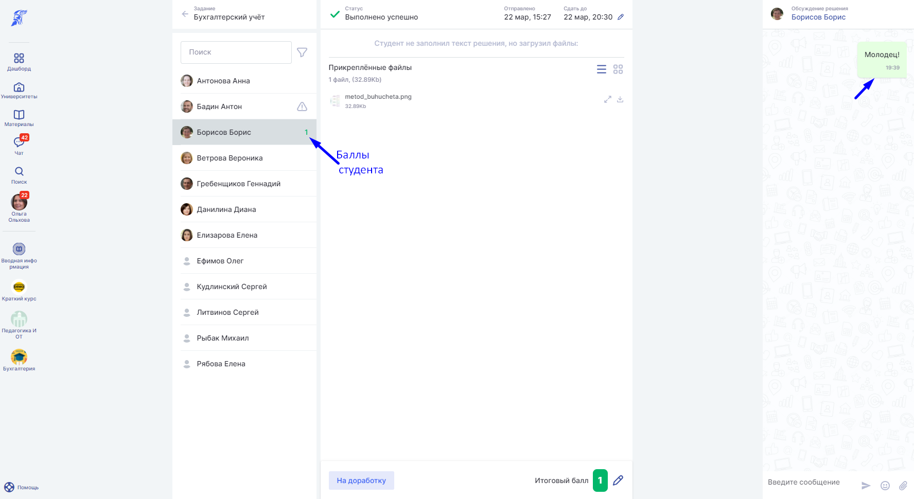
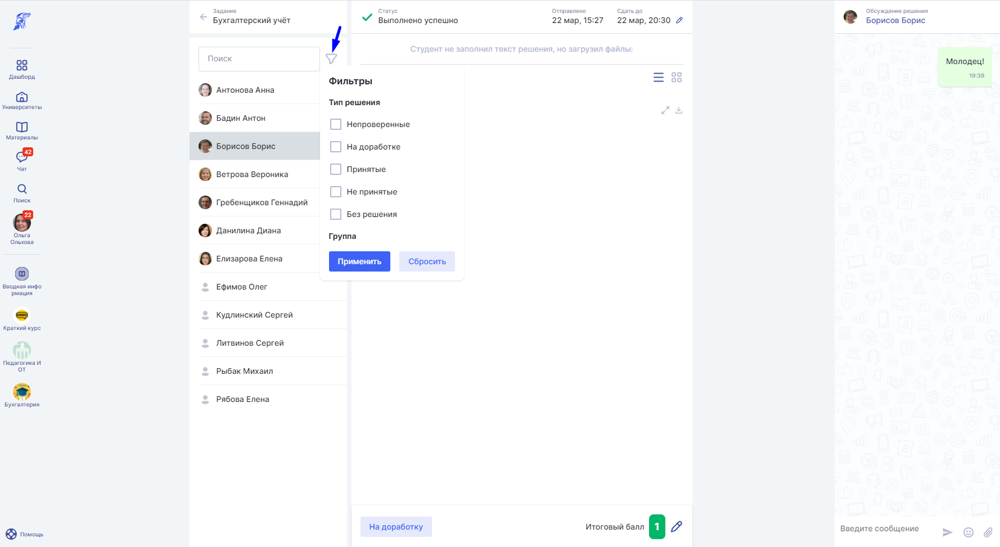
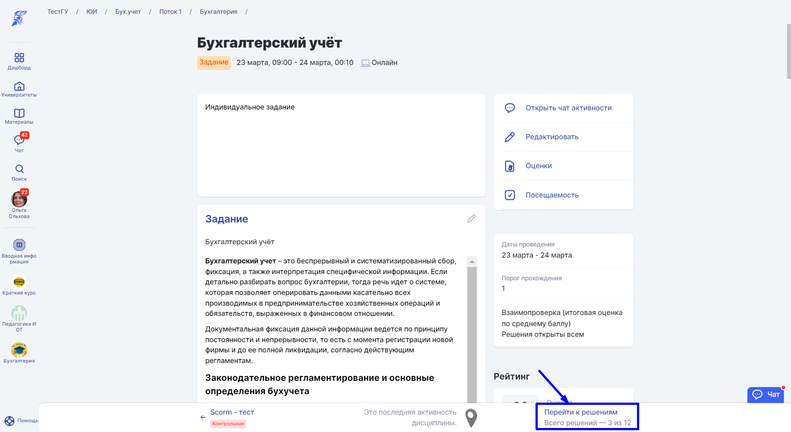
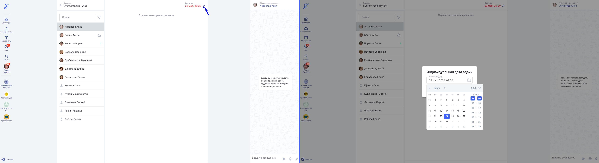

# Добавление Задания

Перейдите на страницу [создания](../) или редактирования активности. В поле тип активности укажите "Задание".

В блок "Настройки задания" перенесены настройки для отображения видимости решений студентов друг другу и взаимопроверки ответов. В этом блоке можно установить минимальный пороговый балл для того, чтобы эта активность была зачтена и попала в Прогресс к студенту.&#x20;


В случае, если у Задания нет требований по количеству баллов для его прохождения, поставьте 0.


Преподаватель может включить в активности **Задание** режим **"Взаимопроверка"**.\
При включении этого режима каждый студент сможет поставить оценку за решение другого. На основании оценок от других студентов Преподавателем выводится итоговая оценка за решение.\
Чтобы начать использование этой возможности на странице **создания** или **редактирования** [активности](../) **Задание**, включите переключатель Взаимопроверка. При данном способе проверки решения будут доступны всем.

<figure><figcaption></figcaption></figure>


Если у Задания включен **режим взаимопроверки**, на странице "Все решения" появляется дополнительный столбец, где отображается оценка, выставленная другими студентами. Если решение приложено, то для студентов отображается только 1 столбец с возможностью ввода оценки по решению.&#x20;

Себе оценку поставить нельзя.


После включения настроек появляется ещё одно поле “**Расчет итоговой оценки**” с выпадающим списком, где следует установить, какую оценку выставлять студенту. Доступно три значения:

* средняя (установлена по умолчанию);
* минимальная;
* максимальная.

.png>)

При решении Задания студент может использовать текст и файлы для решения Задания.&#x20;

.png>)

Чтобы отредактировать приложенный файл для решения, нажмите кнопку удалить. При отправке ответа преподавателю нажмите кнопку "Отправить решение".

 (1).png>)

Чтобы скачать файл решения Задания, нажмите кнопку "Скачать файл". Отредактируйте ответ, нажав на кнопку редактирования в правом нижнем углу поля "Задание".

.png>)

На странице "Задания" предусмотрен собственный чат для решений студента, их корректировки и замечаний со стороны преподавателя. Вся история решений сохраняется, а окончательная оценка переносится в таблицу оценок на странице [дисциплины](../../disciplina/). Если студент отправил решение, то преподаватель увидит на странице "Все решения" в активности "Задание" набранные **баллы студента**.

Воспользуйтесь удобным фильтром для быстрого поиска решений студентов по категориям.

Перейдите на страницу **Перейти к решениям** в активности Задание, нажмите карандаш на странице решения студента и установите индивидуальный срок сдачи. Студент увидит свой крайний срок сдачи.

