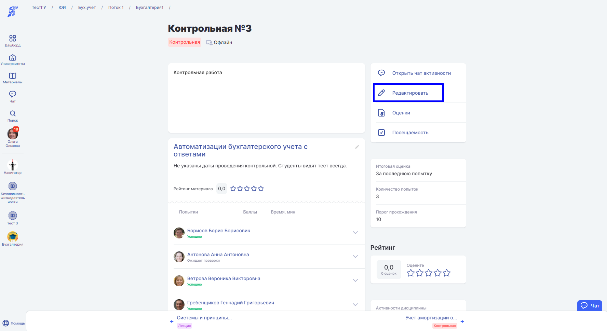
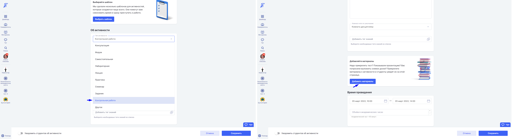
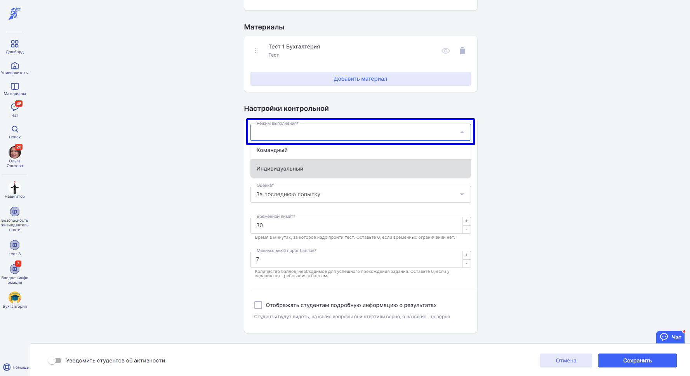
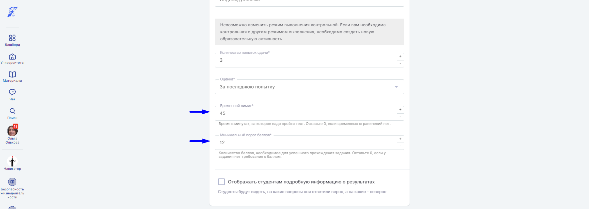
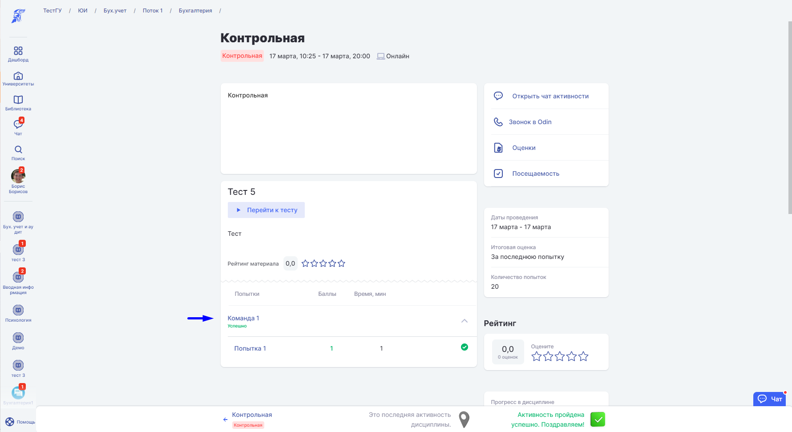
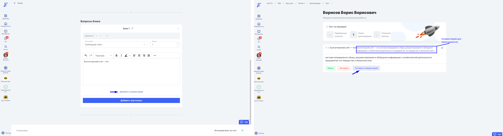
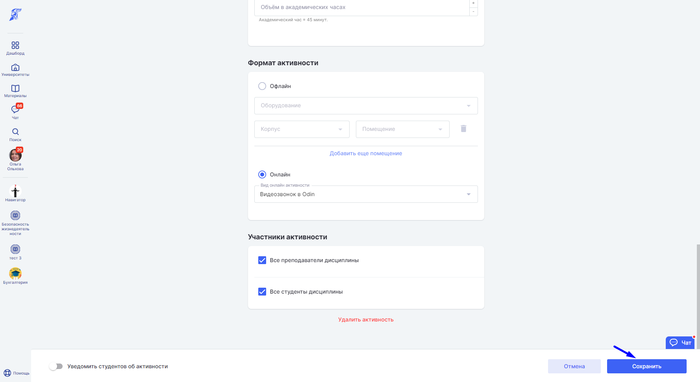

Добавьте [по инструкции](./../_index) Активность "Контрольная", а затем перейдите на  страницу активности и нажмите кнопку "Редактировать".

При создании/редактировании активности "Контрольная" в блоке "Материалы" [добавьте тест ](./../../../../instrukcii-po-rabote/testirovanie-iz-skorm-paketov/dlya-prepodavatelei/kak-sozdat-test-poshagovaya-instrukciya)и другие [материалы](./../../../../servisy/biblioteka/materialy/_index) при необходимости, выставите тип активности, режим выполнения, временной лимит, минимальный порог баллов.

Режим выполнения - раздел настройки Контрольной. В поле "Режим выполнения" можно выбрать индивидуальное или командное выполнение активности.

В командном режиме при выполнении Контрольной одним из членов команды оценку получат все участники по лучшей или по последней попытке.

В режиме конструктора тестов можно добавить комментарий. Комментарий увидит только преподаватель. Чтобы оставить комментарий студенту при проверке Контрольной нажмите кнопку "Оставить комментарий".

:::info 

Удалить комментарий нельзя, если есть попытки.

:::

:::info 

Время прохождения учитывается только для [тестов](./../../../../servisy/biblioteka/materialy/test/_index), которые сделаны в конструкторе тестов в системе Odin.

:::

Сохраните Контрольную на странице активности, нажав кнопку "Сохранить".

Если к Активности или к [Шаблону активности](./../../../../servisy/biblioteka/materialy/shablon-aktivnosti) прикреплен материл с типом "Тест" с заполненным пороговым значением или установленным лимитом времени, то эти значения будут перенесены в "Настройки контрольной" автоматически и появятся на странице Контрольной.

.png>)