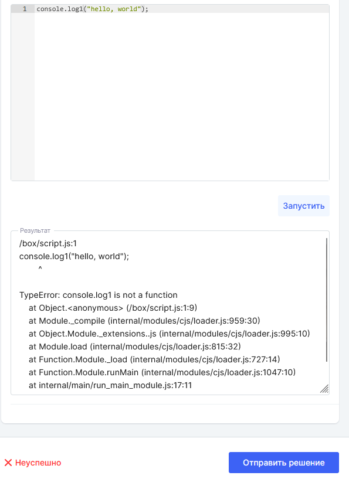

:::danger 

Разработка носит экспериментальный характер. На старте работы организации в Odin возможность использовать такой тип активности отключена. Для подключения необходимо написать нам на support@odin.study

:::

### Подробнее о начале работы с активностью Разработка

Во всех доступных для создания материалов библиотеках образовательной организации (исключая личную библиотеку) появится новый тип "**Программирование**".

Создайте материал с типом "Программирование".

.png>)

В тексте задачи обязательно напишите информацию:

-  о **входных  параметрах** и каким образом студенту необходимо будет подать их на вход: в одну строку, через запятую, каждый параметр на своей строке;

-  о **языке**, который должен использовать студент. Если созданный материал на  Python, а студент напишет правильное решение на  С++, то при запуске алгоритм пройдёт компиляцию, но результат активности будет "Неуспешно".

.png>)

Выберите язык программиривание, который должен будет использовать студент при написании решения, заполните входные параметры и результат.

 (4) (1).png>)

Перейдите на страницу Дисциплины, куда будете добавлять Активность.

.png>)

### Активность под студентом

Открыть активность и перейти к решению

 (6).png>)

Ввести значения входных переменных, решение задачи и запустить проверку.

 (6).png>)

После получения результата "Отправить решение".

 (4).png>)

#### Сообщение в случае ошибки

Если код содержит ошибки, то они будут показаны в блоке «Результат». При этом отправка решения на проверку будет доступна, но такое решение будет считаться «Неуспешным».

{width=595px height=817px}