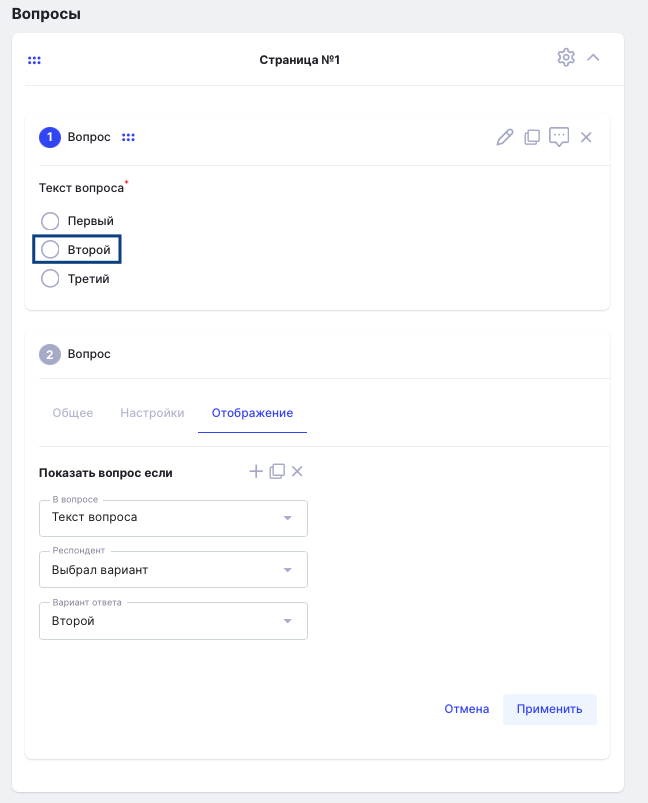

Добавить опрос можно через библиотеку по кнопке «Материал+»- «Опрос». 

{width=324px height=381px}

На стартовой странице создания/редактирования опроса надо заполнить поля с названием, описанием, добавить автора материала, отметить допустимое количество попыток прохождения (однократно или без ограничений), выбрать тип опроса (открытый, анонимный).

 Также определить возможности доступа.

{width=691px height=718px}

Далее начинается работа с самим опросом. Можно сделать одним блоком, а можно добавить несколько по кнопке «Добавить страницу».

{width=713px height=861px}

По кнопке с шестеренкой можно редактировать название блока, дублировать его или удалить весь блок. 

{width=788px height=238px}

Возможны несколько типов вопроса в опросе:

{width=582px height=228px}

При выборе каждого из них будут меняться поля, необходимые для заполнения при создании вопроса. Например, для диапазон надо внести следующие данные:

{width=606px height=514px}

Раздел «Настройки» также изменяется в зависимости от типа вопроса. При одиночном или множественном выборе можно установить, обязательный ли это вопрос.

{width=594px height=309px}

 При выборе типа вопроса «Диапазон» можно также выбрать отображение шкалы.

{width=603px height=285px}

Также удобным может быть отображение следующего вопроса, если в предыдущем выбран тот или иной ответ. Это возможно через раздел «Отображение». То есть если в первом вопросе респондент выбрал вариант ответа «Второй», то ему отобразится второй вопрос. Если же он выберет «Первый» или «Третий», то система не покажет ему этот вопрос.

{width=648px height=803px}

Для сохранения вопроса обязательно надо нажимать на «Применить».

После добавления всех вопросов, опрос готов. Его можно добавить как материал в ту активность, где необходимо будет его провести. 