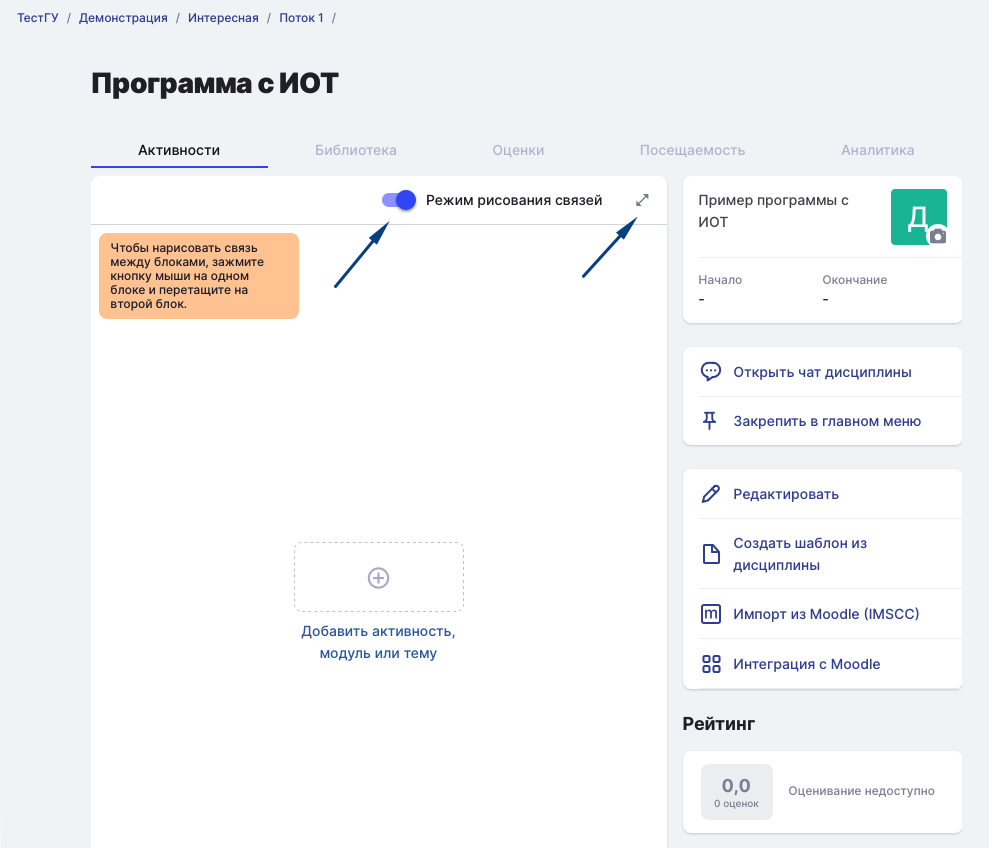

При выборе типа создаваемой дисциплины важно понимать, хотите ли вы сделать какие-то из активностей обязательными / необязательными для прохождения в процессе обучения студентов. Если нет и студент должен последовательно изучить всю программу - выбирайте линейную дисциплину. Если требуется дать студенту выбор образовательного направления в дисциплине, тогда подойдут дисциплины с индивидуальными образовательными траекториями.

[tabs]

[tab:Линейная дисциплина]

Все активности добавляются по порядку одна за другой.

 (1) (1).png>)

Если порядок активностей необходимо изменить, используйте перетаскивание: кликните на значок  с точками рядом с названием активности и, удерживая клавишу мыши нажатой, переместите активность на требуемую позицию в дисциплине.

 (1).png>)

[/tab]

[tab:Дисциплина с ИОТ]

**ИОТ - индивидуальные образовательные траектории**

Дисциплина - граф, в которой можно выстроить нужный порядок для прохождения Активностей/Модулей/Тем.

Все Активности добавляются  и группируются в требуемом порядке.  Модули и Темы  могут быть обязательными или необязательными для изучения.

Для заполнения дисциплины перейдите в режим редактирования связей и разверните рабочую область.

{width=989px height=848px}

После добавления Модулей/Тем/ Активностей дисциплины с ИОТ студенты могут выбрать определённый сценарий для обучения, то есть все студенты могут пройти общий модуль, затем пройти обучение по одной из веток графа и встретиться в заключительном Модуле/Активности.

 (1) (2) (1).png>)

[/tab]

[/tabs]

