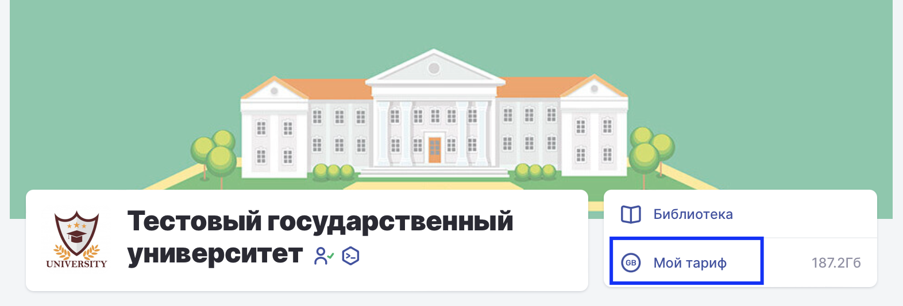
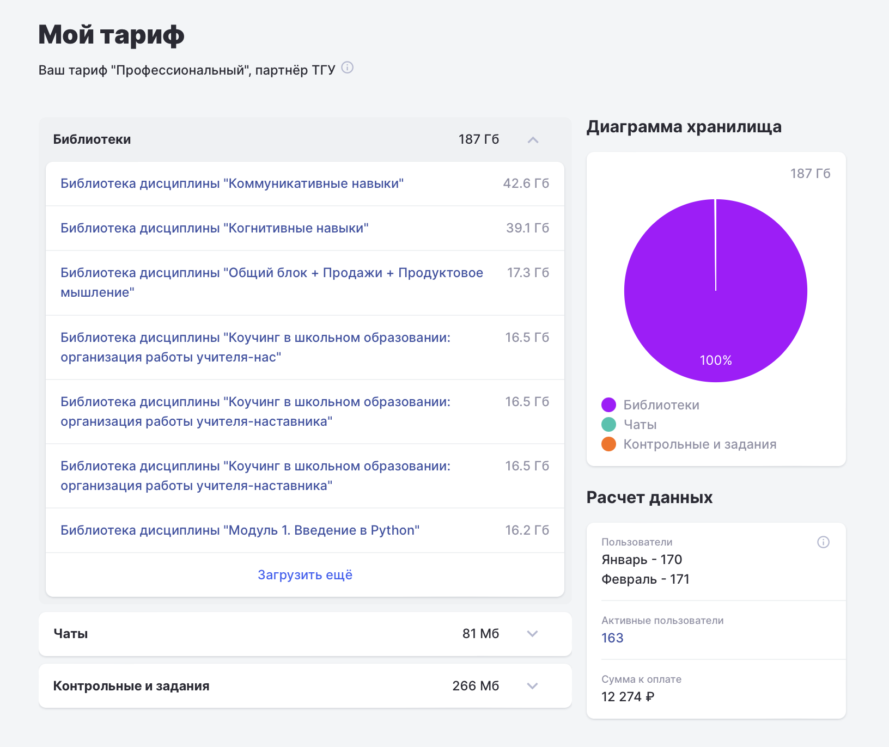
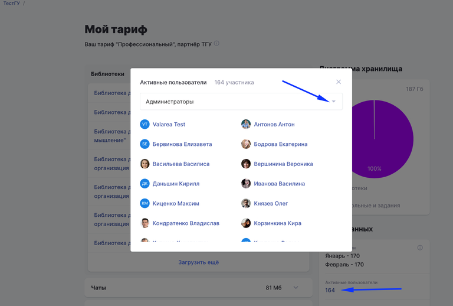

{width=1572px height=534px}

Сумма рассчитывается для всех организаций, которые используют   Odin на платной основе. \
Для таких организаций устанавливается тариф "Профессиональный” .

В расчёте суммы к оплате участвуют активные пользователи и объём хранилища, занимаемый материалами организации.

:::info 

Активные пользователи - администраторы организации, подразделений, программ, потоков, кураторы групп, преподаватели, контент-менеджеры, студенты.

:::

:::info 

Аудиторы не входят в число активных пользователей. \
Также не учитываются заблокированные пользователи и пользователи из программ проекта Активные меры содействия занятости.

:::

{width=1632px height=1372px}

### **Как посмотреть активных пользователей?**

:::info 

Значение активных пользователей - это их количество на вчерашнюю дату (т.к. значение рассчитывается ночью).

:::

Список активных пользователей можно посмотреть, кликнув на их количество в блоке "Расчёт данных".

{width=768px height=518px}

### **Из чего складывается сумма оплаты?**

Сумма к оплате указывается только за полный предыдущий месяц ( пример с 01.12 по 31.12) и равна сумме ( оплата за активного пользователя \* количество активных пользователей) и (количество занимаемых Гб \*стоимость хранения одного Гб).\
Стоимость 1Гб и одного активного пользователя указана в вашем договоре.

### Как убрать пользователей из активных?

Для того чтобы пользователи исчезли из списка активных необходимо потоки/программы со студентами отправить в архив.\
Сотрудников необходимо открепить от группы/дисциплины/программы/подразделения/организации, то есть убрать у них роль в Odin.

### Как уменьшить объём занимаемого хранилища?

На странице "Мой тариф" Вы можете оценить  объём материалов в библиотеках, чатах, в контрольных/задания и удалить лишние/неиспользуемые материалы.